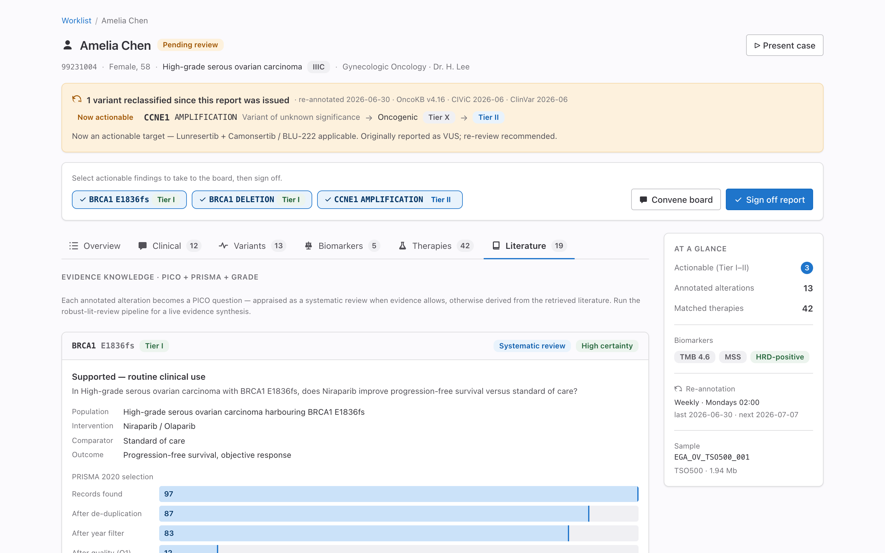
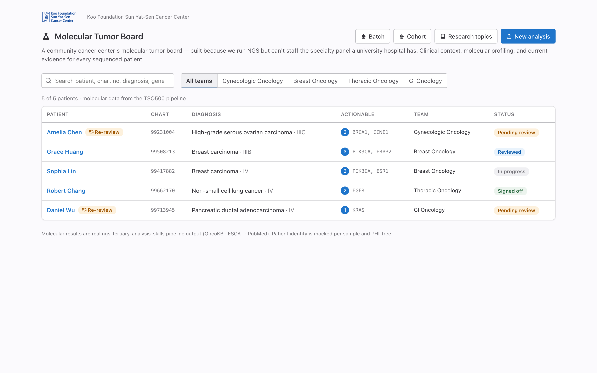
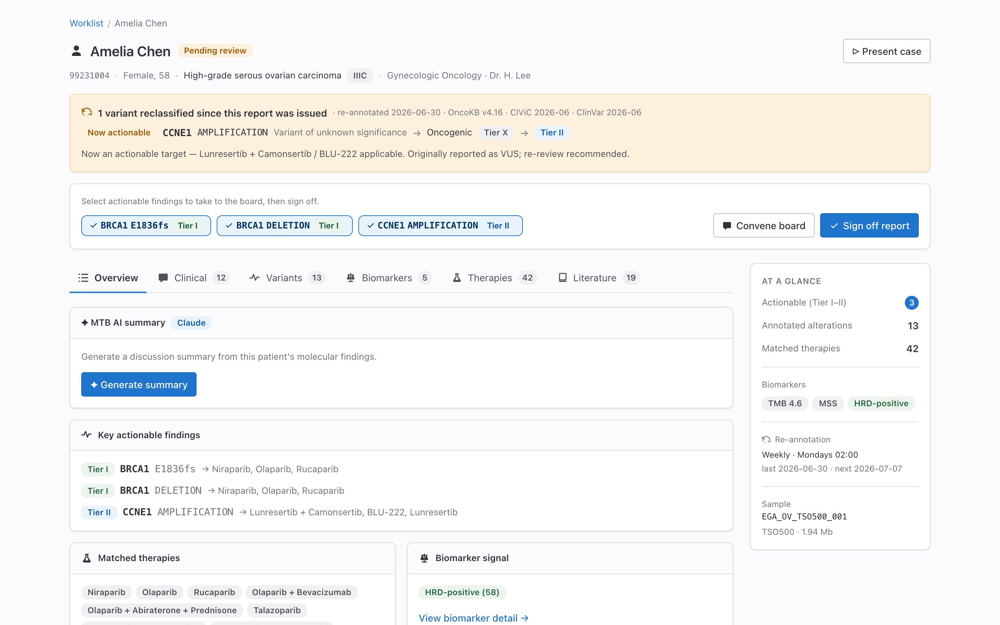
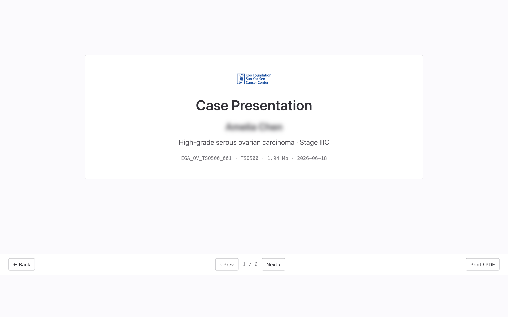
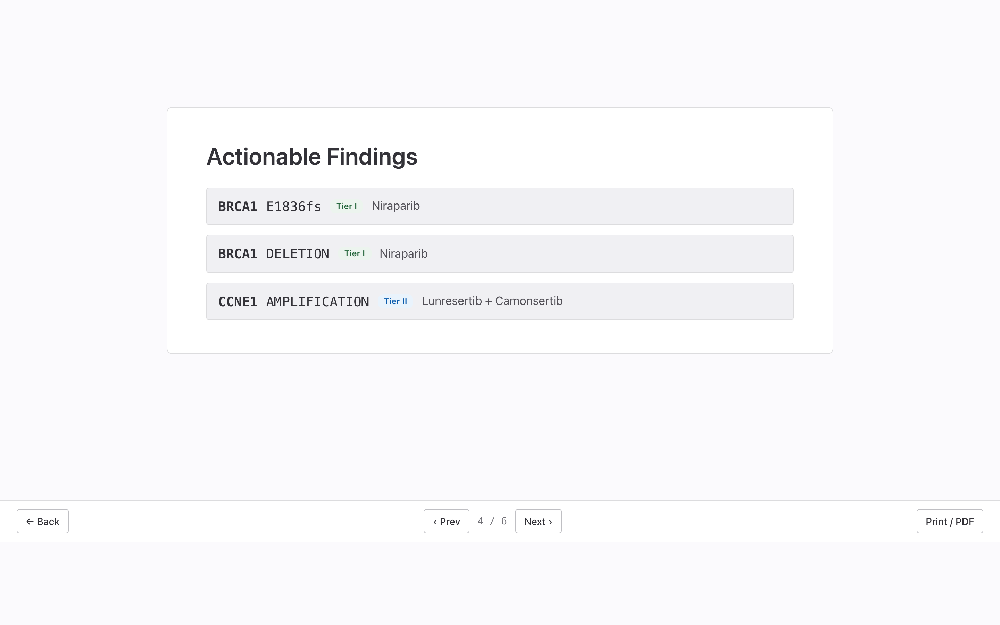

# MTB Platform — an AI-assisted Molecular Tumor Board for community cancer centers

[](https://mtb-platform.pages.dev/)
[](https://github.com/htlin222/mtb-platform/actions/workflows/deploy.yml)
[](./mtb-platform/LICENSE)
[](https://claude.com/claude-code)

**Precision-oncology decision support that turns real NGS tertiary-analysis output
into a per-patient molecular report, grounds every recommendation in appraised
literature (PICO · PRISMA · GRADE), and generates a board-ready case presentation.**

Built for a *community* cancer center — one that runs next-generation sequencing but
can't staff the specialty molecular-tumor-board (MTB) panel a university hospital has.
The platform reads genuine OncoKB / ESCAT annotation, matches FDA and investigational
therapies, appraises the evidence per gene, and re-annotates signed reports so a
variant reported as a VUS today is flagged the day it becomes actionable.

> **Live app → https://mtb-platform.pages.dev/**

[](https://mtb-platform.pages.dev/)

## Highlights

- 🧬 **Per-patient molecular report** — ESCAT-tiered variants, OncoKB-matched
  therapies, TMB / MSI / HRD biomarkers, copy-number & fusions, from real
  `ngs-tertiary-analysis-skills` pipeline output.
- 📚 **Per-gene PICO literature review** — each alteration becomes a PICO question
  appraised as a systematic review (PRISMA 2020 selection + GRADE certainty), or
  derived from retrieved PubMed evidence, with one-click live synthesis via
  [robust-lit-review](https://github.com/htlin222/robust-lit-review) and the Anthropic API.
- 📝 **AMA-default citations** (Vancouver / APA) with clipboard copy, reference-list
  export, and a [mybib.com](https://www.mybib.com/) hand-off.
- 🩺 **Case-presentation deck** — a keyboard-navigable, print-to-PDF slide deck for the
  live board meeting, with blur-until-click patient identity and AI-drafted narration.
- 🔁 **Re-annotation** — signed reports are re-screened against updated knowledge bases;
  newly actionable variants raise an alert.
- 🧪 **Live VCF upload**, animated tertiary-analysis pipeline view, tumor-board voting,
  cohort oncoprint dashboard, and IGV.js genome browser.

## Screenshots

| Worklist — shared multi-team inbox | Report — re-annotation + board sign-off |
| --- | --- |
| [](mtb-platform/docs/screenshots/01-worklist.png) | [](mtb-platform/docs/screenshots/02-report-overview.png) |
| Case deck — title slide (PHI blurred) | Case deck — actionable findings |
| [](mtb-platform/docs/screenshots/04-deck-title.png) | [](mtb-platform/docs/screenshots/05-deck-actionable.png) |

## How it works

```
NGS pipeline reports/ → scripts/build-data.mjs → public/data/*.json → React SPA
                                                                         │
                              Anthropic API (Cloudflare Pages Functions) ┘
                              /api/summary · /api/litreview · /api/narrate
```

The molecular content is the **genuine analysis result** read directly from each
sample's pipeline artifacts (ESCAT tiers, OncoKB oncogenicity & matched treatments,
biomarkers, CNV/fusions, PubMed hits). Patient identity is **mocked per sample and
PHI-free** — real patient directories never enter the repo. Every AI feature is an
Anthropic Pages Function that degrades gracefully (HTTP 503) when no key is set, so
the app runs fully offline.

## Tech stack

Vite · React · TypeScript · GitLab **Pajamas** design tokens (no UI-framework
dependency) · react-router-dom (HashRouter) · IGV.js · Chart.js · Vitest ·
**Cloudflare Pages + Functions** · **Anthropic API** · GitHub Actions CI/CD.

## Getting started

The application lives in [`mtb-platform/`](./mtb-platform) — see its
[README](./mtb-platform/README.md) for development, data generation, and the
optional Anthropic API-key setup.

```bash
cd mtb-platform
pnpm install
pnpm dev        # local dev server
pnpm test       # Vitest (pure-logic libs)
pnpm build      # production build → dist/
```

Pushes to `main` build and deploy to Cloudflare Pages via
[`.github/workflows/deploy.yml`](./.github/workflows/deploy.yml).

## License

[MIT](./mtb-platform/LICENSE) · Built with [Claude Code](https://claude.com/claude-code)
for *Built with Claude: Life Sciences*.
