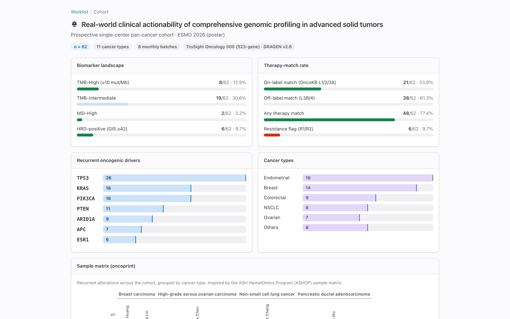

# MTB Platform — a community cancer center's molecular tumor board

**Live: https://mtb-platform.pages.dev/** · Built with Claude Code for
*Built with Claude: Life Sciences* (Builder Track).

We are a community cancer center — not a university hospital. We run NGS but
can't staff the specialty panel a molecular tumor board needs, and we need to
stay current with fast-moving evidence. So we built the tumor board we couldn't
staff: it turns real molecular-profiling output into a per-patient report, lets
you drop a VCF and see actionable genes light up live, convenes an expert panel,
grounds every call in the literature, and **re-annotates signed reports** so a
variant reported as VUS today is flagged when it becomes actionable tomorrow.

A single TypeScript interface styled with GitLab's
[Pajamas design system](https://design.gitlab.com/).

## Screenshots

| Worklist — shared multi-team inbox | Report — re-annotation + board sign-off |
| --- | --- |
| [](docs/screenshots/01-worklist.png) | [](docs/screenshots/02-report-overview.png) |
| **Literature — per-gene PICO + PRISMA + GRADE** | **Case deck — blur-until-click PHI** |
| [](docs/screenshots/03-literature-knowledge.png) | [](docs/screenshots/04-deck-title.png) |
| **Case deck — actionable findings** | **Cohort — biomarker & oncoprint dashboard** |
| [](docs/screenshots/05-deck-actionable.png) | [](docs/screenshots/06-cohort.png) |

## What it does

- **Per-gene PICO evidence knowledge** (Literature tab) — every annotated
  alteration becomes a PICO question, appraised as a systematic review (PRISMA
  2020 selection + GRADE certainty + verified studies) when evidence allows, or
  derived from the retrieved literature otherwise. One click runs a live
  [robust-lit-review](https://github.com/htlin222/robust-lit-review) evidence
  synthesis via the Anthropic API.
- **AMA-default citations** (Vancouver / APA too) with copy-to-clipboard, a
  numbered reference-list export, and a [mybib.com](https://www.mybib.com/) hand-off.
- **Case-presentation deck** (`/deck/:chartNo`) — an in-room, keyboard-navigable,
  print-to-PDF slide deck synthesised from the report, with blur-until-click
  patient identity and live AI-drafted narration.

- **Worklist → report** with Overview, Clinical journal, Variants, Biomarkers,
  Therapies, and Literature (PRISMA + GRADE) tabs.
- **Live VCF upload** — parsed entirely in the browser, annotated against a
  bundled hg19 actionable-gene set; feeds a live report.
- **Animated 9-stage pipeline** view mirroring the real tertiary-analysis stages.
- **Tumor board** — convene a panel of specialist personas, vote, capture a decision.
- **Research topic chat** — turn a clinical gap into a PRISMA/GRADE review topic.
- **Cohort dashboard** with the center's real ESMO 2026 pan-cancer numbers and an
  ASHOP-style sample-matrix oncoprint.
- **Batch genome view** (IGV.js) and **Chart.js** tier charts.
- **Re-annotation** alerts when a variant's significance changes.
- **Claude AI summary** — a Cloudflare Pages Function calls the Anthropic API to
  draft an MTB discussion summary from the real findings (see setup below).

## Claude usage

The entire platform was built in a single Claude Code session, orchestrating the
integration of four data sources (an NGS tertiary-analysis pipeline, a hospital
EMR/consult schema, a PRISMA literature pipeline, and a tumor-board collaboration
model) and browser-driven verification of every view. At runtime, the AI summary
feature calls the Anthropic Messages API from a Pages Function.

## Data sources

| Source                             | Role                                       | What flows into the platform                                     |
| ---------------------------------- | ------------------------------------------ | ---------------------------------------------------------------- |
| **ngs-tertiary-analysis-skills**   | BAM/VCF → OncoKB annotation, ESCAT tiering | variants, treatments, TMB/MSI/HRD, CNV, fusions, PubMed hits — **real** |
| **consult** (KFSYSCC) schema       | hospital EMR / consult shape               | drives the mocked patient identity / clinical context            |

The molecular content is the **genuine analysis result** read directly from each
sample's pipeline artifacts. Patient identity (name, chart no, demographics,
team) is **mocked per sample and PHI-free** — the pipeline's `reports/` directory
of real patient data never enters this repo.

### What is read from the real pipeline

Per sample, `scripts/build-data.mjs` reads:

- `06-clinical-annotation/escat_tiers.csv` — ESCAT tiers (master alteration list)
- `06-clinical-annotation/oncokb_results.json` — oncogenicity, mutation effect, matched treatments (drug, level, FDA status, description)
- `05-biomarkers/{tmb,msi,hrd}_result.json` — biomarkers with sub-scores (LOH/TAI/LST)
- `03-cnv/cnvkit_segments.tsv` · `04-fusions/fusions.tsv` — copy number & fusions
- `07-literature/pubmed_hits.json` — real PubMed retrieval
- `07-literature/narratives.json` — curated per-variant narratives

Variants of unknown significance (Tier X, non-oncogenic) are filtered so the
report shows only clinically meaningful alterations.

## Architecture

Static SPA (Vite + React + TS + `@primer/react`), no backend. The pipeline is
untouched; the platform consumes its output contract, locked behind TS types
(`src/types/`).

```
ngs pipeline reports/ → scripts/build-data.mjs → public/data/*.json → React SPA (Primer)
```

- **Worklist `/`** — shared multi-team inbox (Primer `DataTable`): diagnosis,
  actionable-finding count, top genes, status.
- **Report `/report/:chartNo`** — five sections via `UnderlineNav`:
  1. **Overview** — key Tier I–II findings, matched therapies, biomarker signal, clinical context
  2. **Variants** — ESCAT-ranked alterations; expand for the curated narrative + OncoKB treatments
  3. **Biomarkers** — TMB/MSI/HRD with sub-scores, CNV table, gene fusions
  4. **Therapies** — every OncoKB-matched treatment, ranked by evidence level, with FDA badge
  5. **Literature** — real PubMed records grouped by gene, linked by PMID

### Design system

GitLab **Pajamas**, light theme. Design tokens (colour scale, typography,
spacing, radii) are hand-authored in `src/pajamas.css` from the documented
Pajamas values, so the app carries no Vue / `@gitlab/ui` dependency. Thin
React primitives live in `src/components/gl.tsx` (`GlCard`, `GlBadge`,
`GlCount`, tabs, table, inline icons).

Colour is reserved for a **single clinical signal** — ESCAT actionability tier
(I → success, II → info, III → warning, IV/X → neutral) — plus report status,
positive biomarkers, and FDA-approved therapies. Everything else stays neutral.

## Development

```bash
pnpm install
pnpm data      # regenerate public/data/*.json from the NGS pipeline output
pnpm dev       # dev server
pnpm build     # tsc + vite production build (static; deployable to Pages / Netlify)
```

`pnpm data` reads the pipeline output from `$NGS_REPORTS`
(default `/Users/htlin/ngs-tertiary-analysis-skills/reports`). The generated
`public/data/*.json` is PHI-free and committed, so the app runs offline.

Stack: Vite · React · GitLab Pajamas tokens (no UI framework dependency) ·
react-router-dom (HashRouter) · IGV.js · Chart.js · Cloudflare Pages + Functions.

### AI summary setup (optional)

The `/api/summary` Pages Function needs an Anthropic API key, kept only as a
server-side secret:

```bash
cp .dev.vars.example .dev.vars   # paste your ANTHROPIC_API_KEY
pnpm secret                      # pushes it to the Cloudflare Pages secret
```

Without the key the feature degrades gracefully (the button shows a setup hint).

## Data & privacy

All committed data is PHI-free: patient identities are mocked per sample, and
molecular content is either real de-identified pipeline output or the center's
aggregate ESMO cohort metrics. The real `reports/` patient directory never
enters this repo.

## License

[MIT](./LICENSE).

